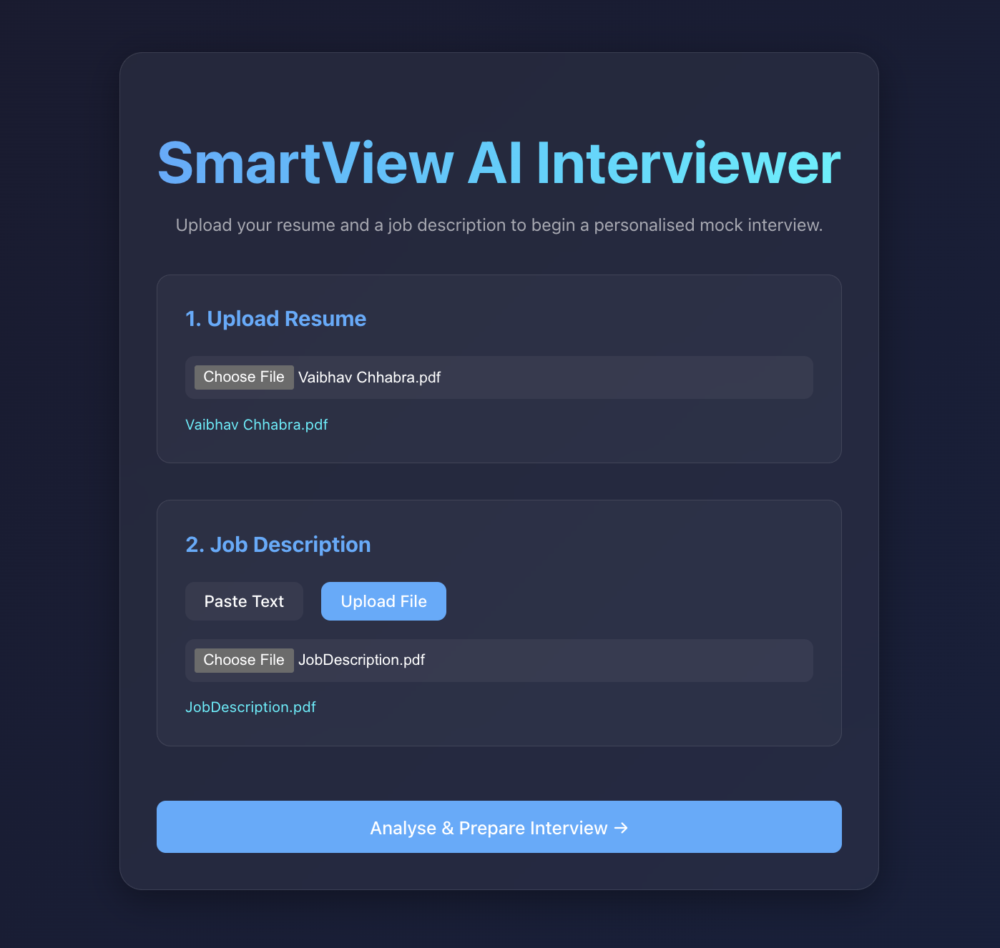
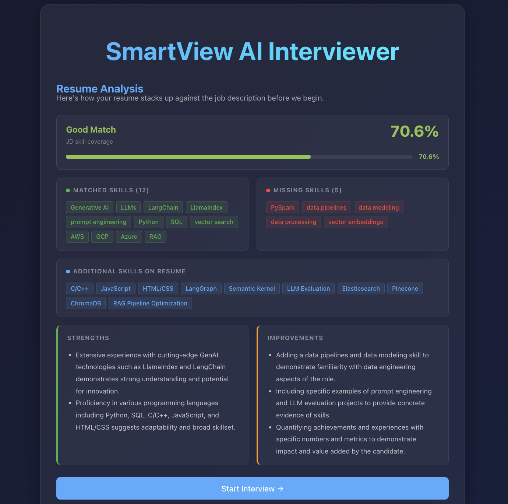
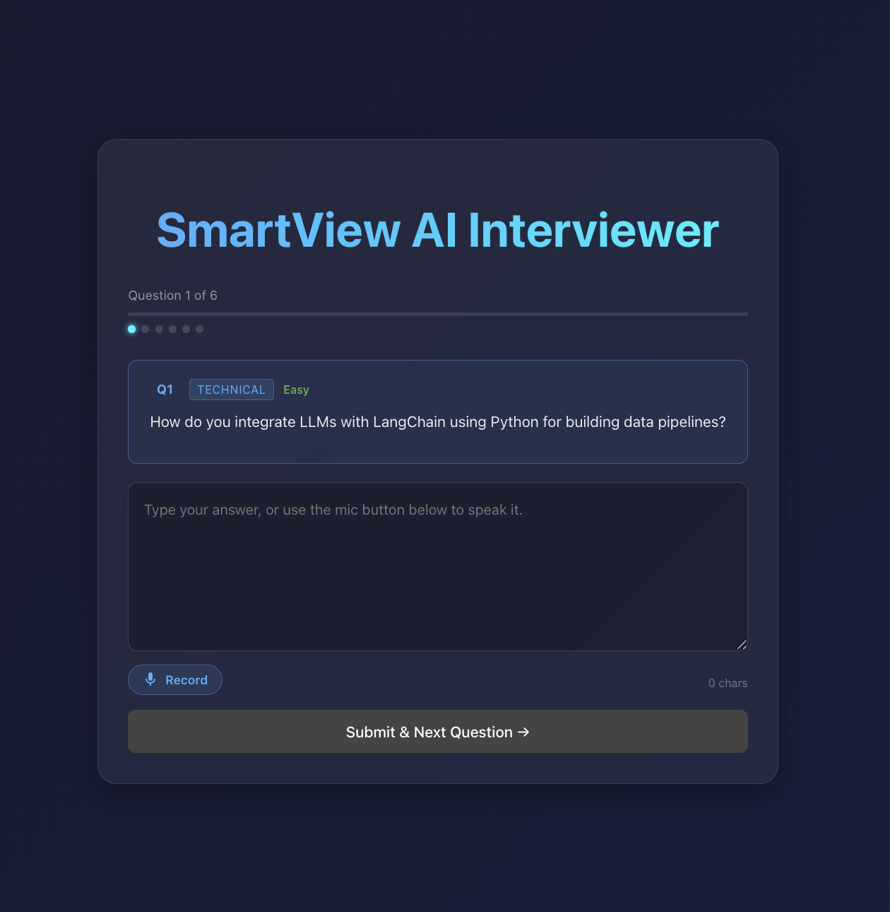
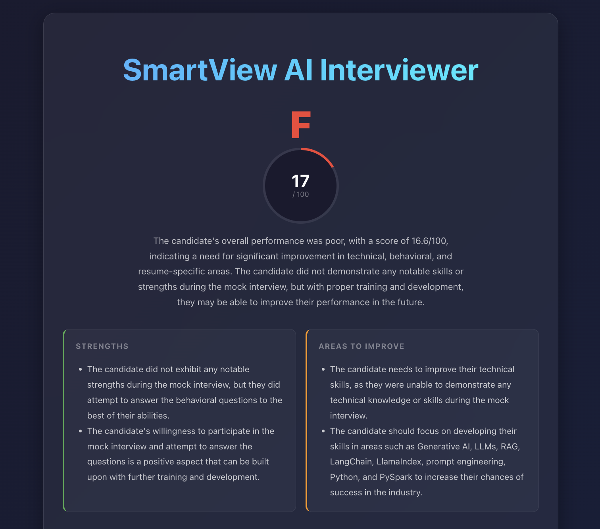

# SmartView AI Interviewer

A stateful multi-agent mock interview platform built with LangGraph. Upload a resume and job description — the system analyses fit, conducts a personalised turn-by-turn interview with voice support, scores answers using LLM evaluation, and delivers a structured feedback report.

---

## Screenshots

> **Setup & Resume Analysis**
> Upload your resume and job description. Live SSE progress steps show extraction and analysis in real time. Before the interview starts, you get a full resume-vs-JD breakdown: semantic skill match score, matched/missing skills, strengths, and improvement suggestions.




> **Interview**
> Answer questions by typing or recording your voice (transcribed via Groq Whisper). Previous Q&As build up in a transcript below. Progress dots track where you are.



> **Score Report**
> After the final answer, scoring runs in parallel across all questions. The report shows an overall score and grade, per-category breakdowns, skill coverage chips, and per-question AI feedback (what went well / what to improve).



> 📸 *To add screenshots: take them from `http://localhost:5173` and save to `docs/screenshots/`.*

---

## Features

- **Resume Analysis** — semantic skill matching (LLM-based, handles synonyms/acronyms), qualitative strengths and improvement suggestions, streamed to the browser before the interview begins
- **Stateful multi-turn interview** — LangGraph `interrupt()` / `Command(resume=)` pattern persists full session state across HTTP requests
- **Voice input** — browser `MediaRecorder` → Groq Whisper transcription, text appended to answer field
- **LLM scoring** — each answer evaluated for quality, depth, and structure (not just keyword overlap); all 6 answers scored concurrently via `asyncio.gather`
- **Structured output** — all LLM calls use forced function-calling so responses always match Pydantic schemas — no hallucinations, no parsing errors
- **Real-time SSE progress** — 4 animated steps stream to the browser during the 15–20s setup phase

---

## Architecture

```
Browser (React 18 + Vite + TypeScript)
        │  SSE (setup)     REST (interview turns)
        ▼
FastAPI (main.py)
  POST /sessions/stream      → SSE: progress + resume analysis + first question
  POST /sessions/{id}/answer → resume LangGraph with candidate's answer
  GET  /sessions/{id}/report → fetch ScoreReport after completion
  POST /transcribe           → Groq Whisper audio transcription
        │
        ▼
LangGraph StateGraph (graph.py)
  ┌─ extract_schemas  ── async LLM  │ Resume+JD → Pydantic schemas
  │                                 │ Redis cache: SHA-256(resume) → 1h TTL
  ├─ analyze_resume   ── sync  LLM  │ Semantic skill match + qualitative feedback
  ├─ generate_questions── sync LLM  │ 6 structured questions with rubrics
  ├─ ask_question ─────── INTERRUPT │ graph pauses, state → SQLite, awaits answer
  │    └─ loops per question ───────┘
  ├─ score_session ───── async LLM  │ parallel LLM eval for all answers
  └─ generate_summary ── sync  LLM  │ narrative, strengths, dev areas
        │
        ▼
SQLite (checkpoints.db)             Redis (localhost:6379)
LangGraph session state             Resume schema cache
```

---

## LangGraph Pipeline

| Node | Type | Model | Purpose |
|---|---|---|---|
| `extract_schemas` | Async + LLM | Quality | Resume PDF/DOCX → `ResumeSchema`; JD → `JobDescriptionSchema`. Checks Redis cache first. |
| `analyze_resume` | Sync + LLM | Quality | Semantic skill matching (handles synonyms, acronyms, implied skills) + 2 strengths + 3 improvement suggestions. Emitted via SSE before questions are shown. |
| `generate_questions` | Sync + LLM | Quality | Generates 6 `Question` objects: 3 technical, 2 behavioral, 1 resume-specific. Each has category, difficulty, rubric keywords, and ideal-answer hint. |
| `ask_question` | **Deterministic** | — | Calls `interrupt(question)`. Graph pauses, full state checkpointed to SQLite. Resumes when `POST /answer` sends `Command(resume=answer_text)`. |
| `route_after_answer` | **Deterministic** | — | If more questions remain → loop. Otherwise → `score_session`. Zero LLM cost. |
| `score_session` | Async + LLM | Fast | All answers evaluated **concurrently** via `asyncio.gather`. Each answer gets a 0–10 score, `what_went_well`, `what_to_improve`. Keyword stats computed in parallel (deterministic). |
| `generate_summary` | Sync + LLM | Quality | Narrative, 2 strengths, 2 development areas from the structured `ScoreReport`. |
| `error_node` | **Deterministic** | — | Terminal node for failed setups. Sets `phase = "error"`. |

~50% of nodes are deterministic — routing, session management, and aggregation involve zero LLM calls.

---

## Key Design Decisions

**Forced tool-use for structured output** — `call_structured()` wraps every LLM call with a single Groq function tool whose `parameters` field is generated from the target Pydantic model's JSON schema. The model is forced to fill this schema; it cannot return free text. Every response is Pydantic-validated before use.

**LangGraph `interrupt()` / `Command(resume=)` for stateful turns** — the graph pauses mid-execution at `ask_question`, checkpointing the full `InterviewState` (schemas, questions, all prior answers) to SQLite via `AsyncSqliteSaver`. `POST /sessions/{id}/answer` resumes it with `Command(resume=answer_text)`. No manual session tracking, no database schemas, no reconstruction logic.

**Semantic skill matching** — `semantic_match_skills()` merges the resume's explicit skills list with technologies from work history entries, then asks the quality LLM to classify every JD-required skill as covered/missing — accounting for synonyms (React = React.js), acronyms (k8s = Kubernetes), version variants (Python 3 = Python), and implied skills (ChromaDB implies vector search). Falls back to an alias dictionary if the LLM call fails.

**Parallel LLM scoring** — `score_session_node` runs all 6 answer evaluations concurrently via `asyncio.gather`, with each sync LLM call dispatched to a `ThreadPoolExecutor`. Total scoring latency ~3–5s regardless of question count, vs ~18s sequential.

**SSE for setup progress** — `POST /sessions/stream` uses LangGraph's `astream_events(version="v2")` to emit `on_chain_end` events as each node completes. The frontend maps these to 4 animated progress steps. The `resume_analysis` event is extracted directly from `event["data"]["output"]` (no extra checkpoint read needed).

---

## Stack

| Layer | Technology |
|---|---|
| LLM | Groq — `llama-3.3-70b-versatile` (extraction, questions, matching, summary), `llama-3.1-8b-instant` (per-answer scoring) |
| Voice transcription | Groq Whisper — `whisper-large-v3-turbo` |
| Agent orchestration | LangGraph 0.2+ |
| Session persistence | SQLite via `AsyncSqliteSaver` (`langgraph-checkpoint-sqlite`) |
| Resume caching | Redis (async, soft-fail) |
| Backend | FastAPI + Pydantic v2 + Python 3.10+ |
| Frontend | React 18 + Vite 8 + TypeScript |

---

## Running Locally

**Prerequisites:** Python 3.10+, Node 18+, Redis

```bash
# 1. Start Redis
brew services start redis

# 2. Backend
cd backend
python -m venv venv && source venv/bin/activate
pip install -r requirements.txt
echo "GROQ_API_KEY=gsk_..." > .env     # free at console.groq.com
python main.py                          # → http://localhost:8000

# 3. Frontend (new terminal)
cd frontend
npm install
npm run dev                             # → http://localhost:5173
```

Open **http://localhost:5173**, upload a PDF/DOCX resume, paste a job description, and click **Analyse & Prepare Interview →**.

### Environment Variables

| Variable | Required | Default |
|---|---|---|
| `GROQ_API_KEY` | Yes | — |
| `REDIS_URL` | No | `redis://localhost:6379` |

---

## Project Structure

```
backend/
  main.py                    FastAPI app, all routes, lifespan (SQLite checkpointer init)
  graph.py                   LangGraph StateGraph — nodes, edges, InterviewState TypedDict
  schemas.py                 All Pydantic models (single source of truth)
  services/
    claude_service.py        Groq SDK wrapper — call_structured() with forced tool-use
    interview_service.py     Resume/JD schema extraction + question generation
    scoring.py               Hybrid scoring: LLM evaluation + deterministic keyword stats
    skill_taxonomy.py        Skill aliases, semantic_match_skills(), match_skills() fallback
    parser.py                PDF / DOCX text extraction (PyMuPDF + python-docx)
    redis_service.py         Resume schema cache (async, soft-fail)

frontend/src/
  App.tsx                    4-phase state machine: setup → analyzing → interviewing → complete
  components/
    SetupScreen.tsx          Upload form + SSE streaming progress (useRef stale-closure fix)
    ResumeAnalysisScreen.tsx Match score, skill chips, strengths, improvements
    InterviewScreen.tsx      Question card, voice input (MediaRecorder), answer textarea, transcript
    ReportScreen.tsx         Score circle, category bars, skill coverage, per-Q accordion
    ErrorBoundary.tsx        React class error boundary
  hooks/
    useVoiceInput.ts         MediaRecorder → POST /transcribe → append to textarea
  types/
    session.ts               TypeScript interfaces mirroring backend Pydantic models
```

---

## API Reference

| Method | Endpoint | Description |
|---|---|---|
| `POST` | `/sessions/stream` | Create session. Multipart: `resume` (File) + `jd_text` (Form) or `jd_file` (File). Returns SSE. |
| `GET` | `/sessions/{id}` | Full session state + answered transcript. |
| `POST` | `/sessions/{id}/answer` | Submit answer `{"answer_text": "..."}`. Returns next question or `phase: "complete"`. |
| `GET` | `/sessions/{id}/resume-analysis` | Resume vs JD analysis (available after session creation). |
| `GET` | `/sessions/{id}/report` | Full `ScoreReport` (available after `phase == "complete"`). |
| `POST` | `/transcribe` | Transcribe audio blob. Returns `{"text": "..."}`. |

For full schema and flow documentation see [ARCHITECTURE.md](ARCHITECTURE.md).
